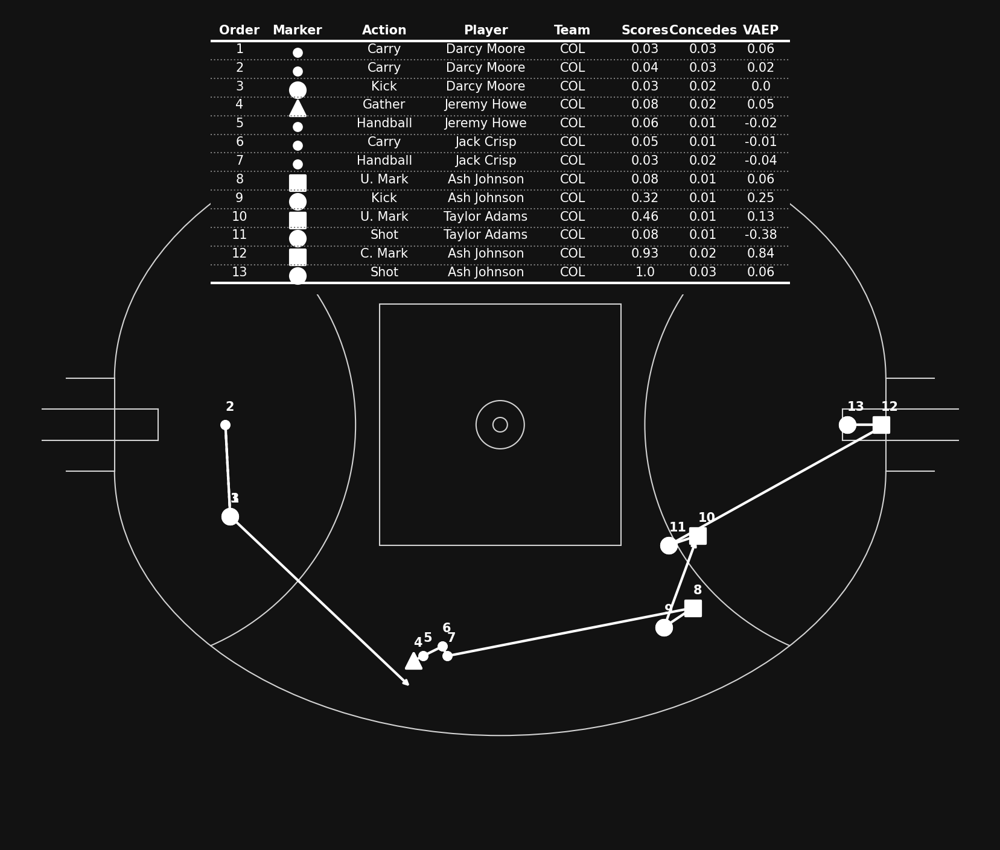

# AFL Player Ratings

afl-player-ratings is a repository designed to bring together a variety of ideas to value AFL players. The ultimate goal is to create a player rating, player value model or range of ratings per player to help quantify and understand player performance.

As well as considering raw stat quantities and Expected Score, I am interested in Expected Possession Value models such as Expected Threat and VAEP from soccer.

Implementations of both will be included and experimental improvements will also be considered and tested.

## Installation

```python
git clone https://github.com/ciaran-grant/afl-player-ratings.git
```

## Usage

Each model or concept has it's own folder with analysis in notebooks and python modules.

Data is sourced from a private R package.

### Expected Threat

[Expected Threat by Karun Singh](https://karun.in/blog/expected-threat.html)

Initially applied as a metric for quantifying "threat" in soccer, I have applied the same concept to AFL across the 2021/2022 seasons.

At any point on the pitch, you can do one of two things when you have the ball:
- Move the ball to another location (Carry, Kick, Handball)
- Shoot

Expected Threat uses historical data to combine the following probabilities:
- Probability of moving
- If moving, what is the probability of moving to any other location?


- Probability of shooting


- If shooting, what is the probability of scoring?


These are all combined to get the "expected threat" values at every location on the pitch. These are interpreted as the likelihood of scoring a goal in the next few actions when you have the ball here.


#### Expected Threat Created

For every successful action that moves the ball from one location to another on the pitch, we can now quantify the expected threat created by getting difference in expected threat between the start and end locations.

For example, moving the ball from the centre square into the goal square will move from ~8% to ~30%. This action would have created 22% Expected Threat and can be attributed to the player who performs the action.

Expected Threat created will highlight players who can move the ball into higher threat areas effectively. Theoretically midfield or forwards who are creative or accurate and excel at inside 50 penetration.

#### Expected Threat Received

Of course for every successful kick or handball, there is also a player receiving. Another way to look at Expected Threat is to see which players are good at receiving the high value passes.

(For carries, I've considered the player performing the carry as both starting and receiving the action.)

Expected Threat received will highlight players who can get free or win contests in threatening areas well. Theoretically these are forwards who are targeted a lot, who also win a lot of possessions inside 50.

#### Expected Threat Denied (Lost)

For every unsuccessful action, there is an expected threat value that could have been realised IF it was successful. This is the Expected Threat denied by the opposition (either through interceptions or error).

Expected Threat denied will highlight how much expected threat the player has been denied (or "lost") by attempting to perform an action. These will usually be higher risk, higher value actions.

#### Expected Threat Prevented

Again, there is the other side of every unsuccessful action (assuming that possession has switched teams). If an action is unsuccessful and the receiver is on the opponent's team, we can attribute that player with the credit for preventing the ball progression.

Expected Threat prevented will highlight defenders and intercepters who can prevent ball progression of the opponent, either by marking themselves or picking up the loose balls.

### Valuing Actions by Estimating Probabilities (VAEP)

VAEP is a framework to assign each action on the pitch a value and overcomes some of the flaws in Expected Threat.
- Values all actions (Handballs, Kicks, Marks, Shots, Ground Ball Gets etc.)
- Introduces game context in addition to only locations
- Considers offensive and defensive consequences of actions

VAEP values are calculated by training two models based on current game context (previous 3 actions gamestate information):
- Probability of scoring (in next 10 actions)
- Probability of conceding (in next 10 actions)

Assuming every action is made to maximise scoring proabilites and minimise conceding probabilities, combining these two probabilities will give an overall net value to every action.

Similar to Expected Threat, the VAEP values are calculated from the scoring and conceding probabilities before/after the action takes place.

Eg. A pass back towards your own goal could decrease your probability of scoring and increase your probability of conceding in the next few actions. 

|        | Scoring % | Conceding % |
| ------ | :-------: | :---------: |
|  Pre   | 10%       | 1%          |
| Post   | 5%        | 4%          |

|        | Offensive |  Defensive  | VAEP |
| ------ | :-------: | :---------: | :--: |
| Value  | -5%       | +3%         |  -8% |


Every action will have an offensive value, defensive value and an overall VAEP value.



[VAEP: socceraction](https://socceraction.readthedocs.io/en/latest/index.html)

[Exploring VAEP](https://dtai.cs.kuleuven.be/sports/vaep)

[Explaining how VAEP works](https://dtai.cs.kuleuven.be/sports/blog/exploring-how-vaep-values-actions/)

Tom Decroos, Lotte Bransen, Jan Van Haaren, and Jesse Davis. “Actions speak louder than goals: Valuing player actions in soccer.” In Proceedings of the 25th ACM SIGKDD International Conference on Knowledge Discovery & Data Mining, pp. 1851-1861. 2019.

Maaike Van Roy, Pieter Robberechts, Tom Decroos, and Jesse Davis. “Valuing on-the-ball actions in soccer: a critical comparison of xT and VAEP.” In Proceedings of the AAAI-20 Workshop on Artifical Intelligence in Team Sports. AI in Team Sports Organising Committee, 2020.

#### Expected VAEP
TBD


## Credits
Data sourced using a private R package. Credits to dgt23.

Expected threat concept from Karun Singh and implementation from mplsoccer/socceraction.

## CONTRIBUTING
I am currently working on this project so any bugs or suggestions are very welcome. Please contact me or create a pull request.

## License

[MIT](https://choosealicense.com/licenses/mit/)


